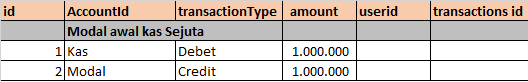
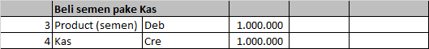
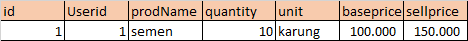
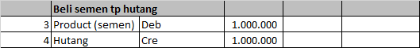
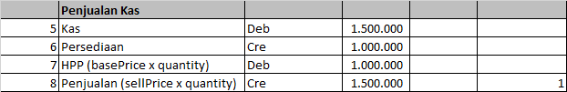
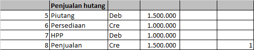
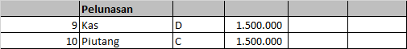
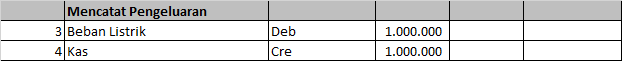

# Final-Project-Team5
## App Business Logic

Panduan Dasar:
```
- Prinsip Dasar Akuntansi:
  Debet = Credit
  => Aset = Liabilitas + Ekuitas
  => Kas + Bank + Persediaan + Piutang(Hutangnya orang ke kita) + dll = Hutang(kita ke orang) + Modal
  Maknanya:
  Ketika melakukan pencatatan, jika sisi kiri dari "=" bertambah, maka sisi kanan juga harus bertambah. Begitu juga sebaliknya

```

## Ketika User pertama kali membuat saldo awal untuk tokonya:
  - akan menambah aset dan modal, bisajuga aset dan hutang, berikut contoh create ledgernya:
  - 

  - menambah persediaan awal juga sama seperti di atas, namun Kas di ganti oleh Product. ditambah create di table Product

## Ketika User melakukan PEMBELIAN Persediaan secara Cash:
  - Akan menambah product di aset, dan mengurangi Kas:
    - ledger:
    - 
    - Product:
    - 

## Ketika User melakukan PEMBELIAN Persediaan secara Hutang:
  - Akan menambah product di aset, dan menambah Hutang:
    - ledger:
    - 
    - Product:
    - sama seperti diatas

## Ketika User melakukan PENJUALAN Persediaan secara Cash:
  - Ledger:
  - 
  - Product:
    - berkurang quantitynya sesuai yg dijual
  - Transaction:
    - semua column diisi sesuai data penjualan, dueDate null, isPaid true

## Ketika User melakukan PENJUALAN Persediaan secara Piutang:
  - Ledger:
  - 
  - Product:
    - berkurang quantitynya sesuai yg dijual
  - Transaction:
    - semua column diisi sesuai data penjualan, dueDate diisi, isPaid false

## Ketika Costumer melakukan pembayaran atas Piutang:
  - Ledger:
  - 
  - Transaction:
    - update isPaid jadi true

## Ketika User mencatat pengeluaran:
  - Ledger:
  - 