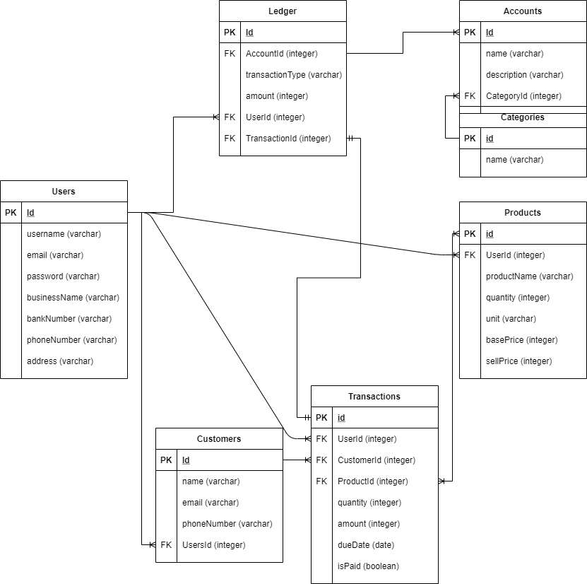

# Final-Project-Team5

## Models:

_User_

```
- username: (VARCHAR) required, unique
- email : (VARCHAR) required, unique
- password : (VARCHAR) required
- businessName : (VARCHAR) required
- bankNumber : (VARCHAR) required
- phoneNumber: (VARCHAR) required
- address : (VARCHAR)
```

_Customer_

```
- name: (VARCHAR) required,
- email : (VARCHAR)
- phoneNumber: (VARCHAR) required (untuk pesan penagihan)
- UserId : (INT) required
```

_Product_

```
- UserId : (INT) required
- productName: (VARCHAR) required,
- quantity : (INT) required
- unit: (VARCHAR) required ex: kg, litre, pcs
- basePrice : (INT) required => harga beli
- sellPrice : (INT) required => harga jual
```

_Transaction_

```
- UserId : (INT) required
- CustomerId : (INT) required
- ProductId : (INT) required
- quantity : (INT) required
- amount : (INT) required => total tagihan (sellPrice * quantity)
- dueDate: (DATE) required
- isPaid: (BOOLEAN) required
```

_Account_

```
- name : (VARCHAR) required => nama akun di pembukuan ex: Kas, Bank, Piutang, Hutang, etc...
- description : (VARCHAR) => keterangan transaksi
- CategoryId: (INT) required
```

_Category_

```
- name : (VARCHAR) required => ex: Pemasukan, Pengeluaran
```

_Ledger_

```
- AccountId : (INT) required
- transactionType : (VARCHAR) required => kode transaksi berdasarkan prinsip Akuntansi "Double entry bookkeeping" yaitu "Debet"/"Credit" => kalo bingung tanya Aji
- amount : (INT) required
- UserId : (INT) required
- TransactionId : (INT) nullable
```

## Associations :
>- User dan Costumer = One-to-Many
>- User dan Product = One-to-Many
>- User dan Transaction = One-to-Many
>- Costumer dan Transaction = One-to-Many
>- Product dan Transaction = One-to-Many
>- Account dan Category = One-to-Many
>- User dan Ledger = One-to-Many
>- Ledger dan Account = One-to-Many
>- Ledger dan Transaction = One-to-One


## Schema :
- - 